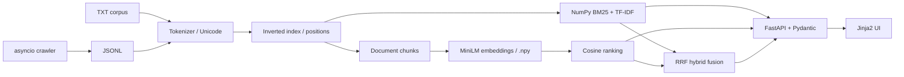

# Потік даних Findex

```mermaid
flowchart LR
 A[TXT corpus] --> T[Tokenizer / Unicode]
 B[asyncio crawler] --> J[JSONL]
 J --> T
 T --> I[Inverted index / positions]
 I --> N[NumPy BM25 + TF-IDF]
 I --> C[Document chunks]
 C --> M[MiniLM embeddings / .npy]
 M --> S[Cosine ranking]
 N --> F[RRF hybrid fusion]
 S --> F
 N --> API[FastAPI + Pydantic]
 S --> API
 F --> API
 API --> WEB[Jinja2 UI]
```

Ранжування NumPy — колонкове in-memory подання старого індексу: бінарний/JSON формат ЛР №1–7 не змінюється. Векторна матриця зберігається в .npy, метадані — в .json.
